# Contexto Game Architecture Diagram

```mermaid
graph TB
    %% Client Side (React Web App)
    subgraph "🖥️ CLIENT (React Web App)"
        subgraph "📱 UI Components"
            GI[GameInterface.tsx<br/>• Game display<br/>• Word input<br/>• Player list<br/>• Winner messages]
            PA[PlayerAvatar.tsx<br/>• Avatar display<br/>• Click handlers<br/>• Medal badges<br/>• Transparency states]
            PT[PlayerTooltip.tsx<br/>• Player stats popup<br/>• Click-outside handling<br/>• Game mode adaptive]
            SC[SettingsComponent.tsx<br/>• Theme toggle<br/>• Preferences UI]
        end
        
        subgraph "🔄 State Management"
            GC[GameContext.tsx<br/>• Socket connection<br/>• Game state<br/>• Player data<br/>• Theme settings<br/>• Answer word storage]
        end
        
        subgraph "🌐 API Layer"
            GA[gameApi.ts<br/>• HTTP requests<br/>• Game CRUD<br/>• Guess submission<br/>• Room management]
            UA[userApi.ts<br/>• User management<br/>• Authentication<br/>• Player stats]
            RA[roomApi.ts<br/>• Room info<br/>• Active rooms<br/>• User rooms]
        end
        
        subgraph "💾 Local Storage"
            LS[localStorage<br/>• Theme preferences<br/>• Game settings<br/>• User preferences]
        end
    end

    %% Communication Layer
    subgraph "📡 COMMUNICATION"
        subgraph "🔌 WebSocket Events"
            WS_C2S[Client → Server<br/>• join_room<br/>• leave_room<br/>• make_guess<br/>• start_game<br/>• get_closest<br/>• update_player]
            WS_S2C[Server → Client<br/>• room_joined<br/>• room_left<br/>• player_joined<br/>• player_left<br/>• guess_result<br/>• player_guess<br/>• game_finished<br/>• game_started<br/>• closest_guesses<br/>• error]
        end
        
        subgraph "🌐 HTTP API Endpoints"
            HTTP_GAME[Game Routes<br/>POST /api/game<br/>POST /api/game/join/:roomId<br/>POST /api/game/guess/:roomId<br/>GET /api/game/closest/:roomId<br/>POST /api/game/leave/:roomId<br/>GET /api/game/stats]
            HTTP_ROOM[Room Routes<br/>GET /api/rooms/:roomId<br/>GET /api/rooms<br/>GET /api/rooms/user/me]
            HTTP_USER[User Routes<br/>POST /api/users/init<br/>GET /api/users/me<br/>GET /api/users/:userId<br/>PUT /api/users/me<br/>POST /api/users/username/anonymous<br/>GET /api/users/stats<br/>GET /api/users/leaderboard]
        end
    end

    %% Server Side
    subgraph "🖥️ SERVER (Node.js + Express)"
        subgraph "🔌 Socket Handlers"
            SH[socketHandlers.ts<br/>• Authentication<br/>• Room management<br/>• Real-time communication<br/>• Event broadcasting<br/>• User state tracking]
        end
        
        subgraph "🚦 Route Handlers"
            GR[gameRoutes.ts<br/>• Game creation<br/>• Join/leave logic<br/>• Guess processing<br/>• Stats aggregation]
            RR[roomRoutes.ts<br/>• Room information<br/>• Active room listing<br/>• User room tracking]
            UR[userRoutes.ts<br/>• User authentication<br/>• Profile management<br/>• Statistics tracking]
        end
        
        subgraph "📊 Management Layer"
            GM[GameManager.ts<br/>• Game lifecycle<br/>• Player coordination<br/>• Game state tracking<br/>• Cleanup operations]
            UM[UserManager.ts<br/>• User authentication<br/>• Activity tracking<br/>• Room assignment<br/>• Statistics management]
            CM[ContextoManager.ts<br/>• Core game logic<br/>• Multi-game coordination<br/>• Player-game mapping]
        end
        
        subgraph "🎮 Game Logic Engine"
            subgraph "🎯 Game Mode Classes"
                CDG[ContextoDefaultGame.ts<br/>🤝 Cooperative Mode<br/>• Shared guesses<br/>• Everyone wins together<br/>• No player elimination<br/>• Public word reveals]
                CCG[ContextoCompetitiveGame.ts<br/>🏆 Competitive Mode<br/>• Individual progress<br/>• Personal leaderboards<br/>• Completion tracking<br/>• No game ending]
                CSG[ContextoStopGame.ts<br/>⚡ Stop Mode<br/>• First winner ends game<br/>• Distance-based ranking<br/>• Game termination on win<br/>• Winner announcement]
                CBG[ContextoBattleRoyaleGame.ts<br/>⚔️ Battle Royale Mode<br/>• Unique word constraints<br/>• Global word tracking<br/>• First winner ends game<br/>• Resource competition]
            end
            
            subgraph "🧠 Core Game Components"
                CBG_BASE[ContextoBaseGame.ts<br/>• Abstract game foundation<br/>• Common game mechanics<br/>• Player management<br/>• Guess validation]
                GS[GameState Interface<br/>• Current game data<br/>• Player rankings<br/>• Guess history<br/>• Completion status]
                API_INT[gameApi.ts Integration<br/>• Contexto API calls<br/>• Word validation<br/>• Distance calculation<br/>• Lemma processing]
            end
        end
        
        subgraph "🗄️ Data Layer"
            subgraph "💽 Database (TypeORM)"
                USER_DB[(Users Table<br/>• id, username<br/>• gamesPlayed<br/>• gamesWon<br/>• averageGuesses<br/>• lastActive)]
                GUILD_DB[(Guilds Table<br/>• Discord integration<br/>• Server settings)]
                FEED_DB[(Feed Channels<br/>• Notification channels<br/>• Game announcements)]
            end
            
            subgraph "⚡ In-Memory Storage"
                GAME_STATE[Game State Cache<br/>• Active games<br/>• Player sessions<br/>• Real-time data]
                USER_CACHE[User Cache<br/>• Active users<br/>• Session data<br/>• Room assignments]
            end
        end
        
        subgraph "🔐 Authentication & Security"
            JWT[JWT Service<br/>• Token generation<br/>• Token validation<br/>• User identification]
            AUTH[Auth Middleware<br/>• Request validation<br/>• User extraction<br/>• Session management]
        end
    end

    %% External Services
    subgraph "🌍 EXTERNAL SERVICES"
        CONTEXTO_API[Contexto API<br/>• Word validation<br/>• Distance calculation<br/>• Game data source<br/>• Daily word generation]
        DISCORD[Discord Bot<br/>• Command handling<br/>• Server integration<br/>• User notifications]
    end

    %% Data Flow Connections
    
    %% UI to State Management
    GI --> GC
    PA --> GC
    PT --> GC
    SC --> GC
    GC --> LS
    
    %% State to API
    GC --> GA
    GC --> UA
    GC --> RA
    
    %% HTTP API Flows
    GA -.->|HTTP| HTTP_GAME
    UA -.->|HTTP| HTTP_USER
    RA -.->|HTTP| HTTP_ROOM
    
    %% WebSocket Flows
    GC <-->|WebSocket| WS_C2S
    GC <-->|WebSocket| WS_S2C
    
    %% Server Internal Flows
    HTTP_GAME --> GR
    HTTP_ROOM --> RR
    HTTP_USER --> UR
    
    WS_C2S --> SH
    SH --> WS_S2C
    
    GR --> GM
    RR --> GM
    UR --> UM
    SH --> GM
    SH --> UM
    
    GM --> CM
    UM --> USER_DB
    UM --> USER_CACHE
    
    CM --> CDG
    CM --> CCG
    CM --> CSG
    CM --> CBG
    
    CDG --> CBG_BASE
    CCG --> CBG_BASE
    CSG --> CBG_BASE
    CBG --> CBG_BASE
    
    CBG_BASE --> GS
    CBG_BASE --> API_INT
    
    GM --> GAME_STATE
    
    SH --> JWT
    GR --> AUTH
    RR --> AUTH
    UR --> AUTH
    
    %% External API
    API_INT -.->|HTTP| CONTEXTO_API
    
    %% Discord Integration
    DISCORD --> USER_DB
    DISCORD --> GUILD_DB
    DISCORD --> FEED_DB

    %% Styling
    classDef clientBox fill:#e1f5fe,stroke:#01579b,stroke-width:2px
    classDef serverBox fill:#f3e5f5,stroke:#4a148c,stroke-width:2px
    classDef gameBox fill:#e8f5e8,stroke:#1b5e20,stroke-width:2px
    classDef dataBox fill:#fff3e0,stroke:#e65100,stroke-width:2px
    classDef extBox fill:#fce4ec,stroke:#880e4f,stroke-width:2px
    classDef commBox fill:#f1f8e9,stroke:#33691e,stroke-width:2px
    
    class GI,PA,PT,SC,GC,GA,UA,RA,LS clientBox
    class SH,GR,RR,UR,GM,UM,CM,JWT,AUTH serverBox
    class CDG,CCG,CSG,CBG,CBG_BASE,GS,API_INT gameBox
    class USER_DB,GUILD_DB,FEED_DB,GAME_STATE,USER_CACHE dataBox
    class CONTEXTO_API,DISCORD extBox
    class WS_C2S,WS_S2C,HTTP_GAME,HTTP_ROOM,HTTP_USER commBox
```

## 🎮 Game Mode Flow Diagram

## 🏗️ Component Architecture

```mermaid
graph LR
    subgraph "🎯 Game Modes"
        DEFAULT[🤝 Default/Cooperative<br/>• Shared progress<br/>• All guesses visible<br/>• Everyone wins together<br/>• Auto-start]
        COMPETITIVE[🏆 Competitive<br/>• Individual progress<br/>• Hidden guesses<br/>• Personal leaderboards<br/>• Never ends]
        STOP[⚡ Stop<br/>• Race to finish<br/>• Distance ranking<br/>• First win ends game<br/>• Host-started]
        BATTLE[⚔️ Battle Royale<br/>• Unique words only<br/>• Resource competition<br/>• First win ends game<br/>• Host-started]
    end
    
    subgraph "📊 Ranking Systems"
        R1[Default: Shared success<br/>All players show same progress]
        R2[Competitive: Individual ranking<br/>By completion time & guess count]
        R3[Stop: Distance ranking<br/>Closest guess wins]
        R4[Battle Royale: Speed ranking<br/>First to complete wins]
    end
    
    subgraph "🎨 UI Features"
        THEME[🌙 Theme System<br/>• Light/Dark/Auto modes<br/>• CSS variables<br/>• localStorage persistence]
        TOOLTIP[💬 Player Tooltips<br/>• Stats on hover/click<br/>• Game mode adaptive<br/>• Positioning system]
        WINNER[🏆 Winner Messages<br/>• Real-time notifications<br/>• Answer word display<br/>• Mode-specific logic]
        MEDALS[🥇 Medal System<br/>• Top 3 ranking display<br/>• Mode-specific visibility<br/>• Dynamic positioning]
    end

    DEFAULT --> R1
    COMPETITIVE --> R2
    STOP --> R3
    BATTLE --> R4
    
    R1 --> THEME
    R2 --> TOOLTIP
    R3 --> WINNER
    R4 --> MEDALS
```

## 🔄 Data Flow Summary

### 📤 Client → Server
- **HTTP**: Game/Room/User CRUD operations
- **WebSocket**: Real-time game interactions, guesses, room events

### 📥 Server → Client  
- **HTTP Responses**: Operation confirmations, data retrieval
- **WebSocket Events**: Live game updates, player actions, game state changes

### 🎮 Game Mode Behaviors
- **Default**: Cooperative gameplay, shared word pool, everyone wins
- **Competitive**: Individual progress tracking, never-ending games
- **Stop**: Race mode, first winner ends game, distance-based ranking
- **Battle Royale**: Unique word constraint, resource competition

### 💾 Data Persistence
- **Database**: User profiles, game statistics, Discord integration
- **Memory**: Active game states, real-time player data, session info
- **Client**: Theme preferences, settings, local game state

### 🔐 Security & Authentication
- **JWT Tokens**: Stateless authentication, user identification
- **Middleware**: Request validation, user context extraction
- **WebSocket Auth**: Token-based socket authentication, session management

---

*This diagram represents the complete architecture of the Contexto multiplayer word-guessing game, showing all communication flows, game modes, and system components.*
